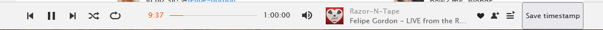
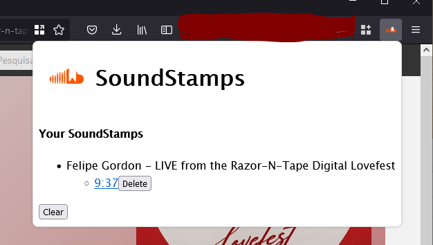

#  SoundStamps

Bookmark timestamps of music you listen on SoundCloud to look for it later. This is very useful when you are listening to a music set and want later search for musics that you liked.

## What it does

This extension adds a ~~beautiful~~ button on SoundCloud's play control bar.



When clicked, the music is saved in a list with a link to the exact time in that track.



## Build instructions

```
$ npm instal && npm run build:prod
```

Then load the file inside `./web-ext-artifacts` as temporary add-on in your browser
